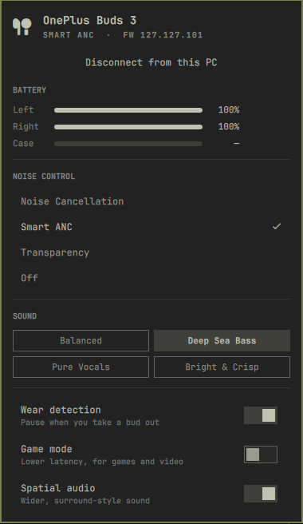

<h1 align="center">OnePlus Experience for Omarchy</h1>

<p align="center"><b>Your OnePlus earbuds' full control center, one click from the bar.</b></p>

<p align="center"></p>

<!-- Demo video: drag an .mp4 or .webm into any GitHub issue or PR comment box,
     copy the https://github.com/user-attachments/assets/... URL it gives you,
     and paste that URL on its own line right here. GitHub renders it inline. -->

## What you get

- **The ANC controls Linux never had.** Not just on/off: **Max / Moderate / Mild**
  strength and **Smart ANC** that adapts to the noise around you. These live in the
  earbuds' own protocol, but no Linux tool exposes them, and on a phone they are
  buried inside HeyMelody.
- **Battery per bud, and the case.** Left, right and case, with charging state. The
  lower bud shows next to the bar icon.
- **EQ presets.** Balanced, Deep Sea Bass, Pure Vocals, Bright & Crisp.
- **Switches.** Wear detection, game mode, spatial audio.
- **Live, not polled.** The buds push changes, so a mode you switch on the buds or
  from your phone appears right away.
- **Keyboard first.** `n` ANC, `s` Smart ANC, `t` transparency, `o` off, `1`–`4` EQ,
  `j`/`k` and Enter to move, Esc to close. Right-click the bar icon to cycle modes.

## What Linux gave you before

| | Controls available | |
|---|---|---|
| Plain Bluetooth (bluez) | `█░░░░░░░░░` | 1 of 10 — one combined battery number |
| HeyMelody (phone only) | `██████████` | 10 of 10 — nothing on the desktop |
| **OnePlus Experience** | `██████████` | **10 of 10, on your PC** |

Counted over: per-bud battery, case battery, ANC, ANC strength, Smart ANC,
transparency, EQ presets, wear detection, game mode, spatial audio.

## What it costs to run

| | | Measured |
|---|---|---|
| Memory | `█░░░░░░░░░` | 8.9 MiB (systemd `MemoryCurrent`) |
| CPU, idle | `░░░░░░░░░░` | 0.2% of one core |
| PyPI packages | `░░░░░░░░░░` | 0 — Python standard library only |
| On disk | `█░░░░░░░░░` | 124 KB |

Measured on OnePlus Buds 3, Omarchy 4, Python 3.14, over a 30 s idle window with the buds disconnected.
Bars are drawn against a 100 MiB / 2% CPU / 10 packages / 1 MB scale.

## Supported earbuds

| Earbuds | Status |
|---|---|
| OnePlus Buds 3 | Everything above, verified on hardware (firmware 127.127.101) |
| Other OnePlus / OPPO / realme buds on HeyMelody | Battery and basic noise control, untested |

To add full support for another model, add its product ID to `MODELS` in
`daemon/oneplus-experience.py`. Reports and pull requests are welcome.

## Install

```bash
omarchy plugin add https://github.com/buildscript-dev/omarchy-oneplus-experience.git --enable
~/.config/omarchy/plugins/io.github.buildscript-dev.oneplus-experience/setup
```

`omarchy plugin add` clones the plugin. `setup` installs `oneplus-experience-ctl`
into `~/.local/bin` and starts a systemd **user** service. No root, no network.

**Needs:** Omarchy 4, `bluez` and `bluez-utils`, and your earbuds already paired.
`libnotify` is optional, for connect and low-battery notifications. Omarchy ships
all of these.

## Settings

| Setting | Default |
|---|---|
| Hide the icon when disconnected | off |
| Show the earbud battery next to the icon | on |
| Path to `oneplus-experience-ctl` | empty, found on `PATH` |

## From the terminal

```bash
oneplus-experience-ctl status
oneplus-experience-ctl noise:anc
oneplus-experience-ctl level:mild
oneplus-experience-ctl eq:0
oneplus-experience-ctl feature:game:off
```

## Remove

```bash
systemctl --user disable --now oneplus-experience
rm ~/.config/systemd/user/oneplus-experience.service ~/.local/bin/oneplus-experience-ctl
rm -rf ~/.config/oneplus-experience ~/.local/state/oneplus-experience
omarchy plugin remove io.github.buildscript-dev.oneplus-experience
```

## Credits

Panel design adapted from [AirPods Experience](https://github.com/MB-JAMBON/omarchy-pods)
by GM and MB-JAMBON (MIT). Protocol notes from
[OppoPodsWindows](https://github.com/3295074384/OppoPodsWindows),
[oppo-pods](https://github.com/osp54/oppo-pods) and
[oneplus-buds-omarchy](https://github.com/GazzasaurusRex/oneplus-buds-omarchy),
checked against real OnePlus Buds 3 hardware. MIT licensed.

## Disclaimer

An independent project, not affiliated with or endorsed by OnePlus or OPPO.
OnePlus, OPPO, HeyMelody and AirPods are trademarks of their respective owners,
and appear here only to describe compatibility.
